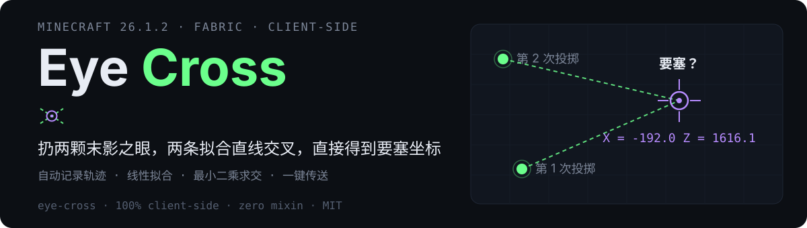

<p align="center">
  
</p>

<p align="center">
  
  
  
</p>

---

**Eye Cross** 是一个纯客户端 Fabric 模组：自动记录末影之眼的飞行轨迹，把每条轨迹拟合成一条直线，两条以上直线求最小二乘交点，扔两颗眼就能拿到要塞坐标。

## 快速上手

1. 安装mod，进入主世界；
2. 随手扔出一颗末影之眼——它破碎或掉落时，飞行轨迹已自动记录；
3. 走远一段（让第二次投掷朝向不同的方向），再扔一颗；
4. 聊天栏给出要塞坐标与误差，点击「[点击传送]」即可一键 `/tp @s X ~ Z`。

扔得越多越准（最多保留最近 12 条）。世界中会在估算位置显示标记；目标超出视距时，你的眼前会出现一支指向要塞的箭头。

<p align="center">
  
</p>

## 它是怎么算的

- **采样**：每个客户端 tick 记录飞行中眼睛实体的 (x, z)；
- **拟合**：对整条轨迹做总体最小二乘（PCA），得到一条直线；
- **求交**：对所有直线最小化「点到直线距离平方和」，解 2×2 正规方程；两线夹角小于 2° 判为近平行，提示换位重试。

## 命令

| 命令 | 作用 |
| --- | --- |
| `/eyecross help` | 用法说明 |
| `/eyecross status` | 每条轨迹与解的详情（坐标可点击传送） |
| `/eyecross reset` | 清空轨迹，重新记录 |
| `/eyecross hud` | 显示 / 隐藏左上角 HUD 小条 |

## 多语言

文案全部走翻译 key，内置 `en_us` / `zh_cn` / `zh_tw`（`assets/eye-cross/lang/`），跟随游戏语言设置，可被资源包覆盖或补充其他语言。

## 构建

需要 JDK 25。

```bash
./gradlew build      # 产物在 build/libs/
./gradlew runClient  # 开发环境试玩
```

## License

[MIT](./LICENSE) © RSPqfgn
